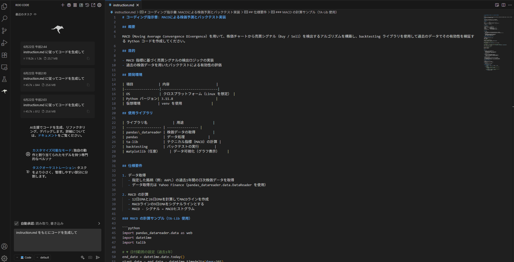
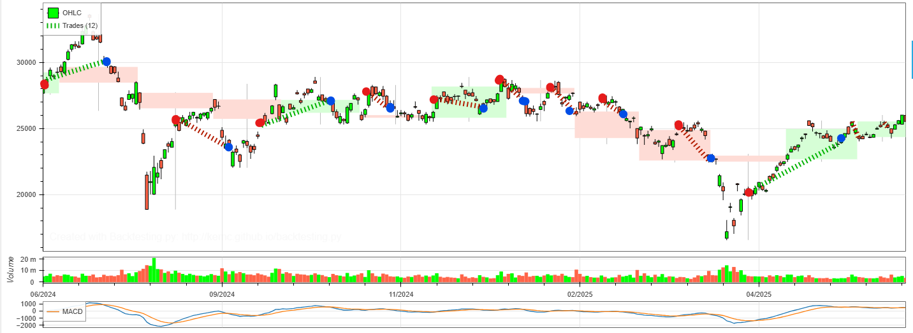
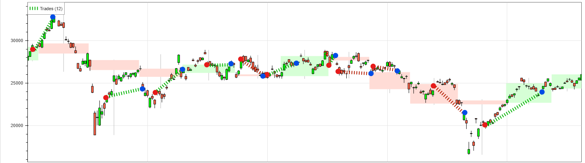

# simplified-investment-decision

## このリポジトリについて

本リポジトリは、株式テクニカル分析指標「MACD」 を用いた売買シグナルの生成および、過去の株価データに対するバックテスト戦略の実装を行った Python プロジェクトです。

現在従事しているソースコードは、守秘義務の観点から外部に公開できない内容を含んでいるため、代替として、一般的に知られている分析手法（MACD）を題材に選定し、生成AIを活用して作成したコードをサンプルとして公開しています。

## コーディング

生成AIによって作られた指示書(instruction.md)をもとに VS Code の拡張機能 Roo Code を利用して、コーディングをさせています。



- APIプロバイダー: VS Code LM API
- copilot - gpt-4

### 一部修正

コーディングされた結果に不備があったため、修正をさせています。

以下の gif は修正しているときの様子（一部）です。


- 変更内容
   - 過去1年のデータに変更
   - 銘柄を日経レバに変更
   - バックテストの手数料を 0 に変更

### 実行結果

MACD を使った売買判断をした結果、損益率は約-19% になりました。

`Return [%]                           -18.6645` (以下実行結果出力より抜粋)

```bash
$ python3 macd_backtest.py
Start                     2024-06-24 00:00:00  # バックテスト開始日
End                       2025-06-19 00:00:00  # バックテスト終了日
Duration                    360 days 00:00:00  # テスト期間（約1年間）
Exposure Time [%]                    53.30579  # テスト期間中にポジションを保有していた割合（約53%）
Equity Final [$]                     813355.0  # テスト終了時の資産額（仮に初期資金が100万ドルなら約18.6%減少）
Equity Peak [$]                     1159800.0  # 最大資産額（ピーク時）
Return [%]                           -18.6645  # 総損益（テスト期間全体）→ 約19%の損失
Buy & Hold Return [%]                -9.33783  # 買って放置していた場合の損益
Return (Ann.) [%]                   -19.35588  # 年率換算のリターン → マイナスで大幅損失傾向
Volatility (Ann.) [%]                22.57177  # 年率換算のボラティリティ → 価格変動は大きめ
CAGR [%]                            -13.46414  # 年平均成長率（複利） → 資産が年平均で減少している
Sharpe Ratio                         -0.85753  # リスクに対するリターン → マイナスは「損失を出しやすい戦略」
Sortino Ratio                         -0.8887  # 下方リスクのみを考慮したリスク調整後リターン → 同様にマイナス
Calmar Ratio                          -0.5405  # 年率リターン ÷ 最大ドローダウン → 小さいほどパフォーマンス効率が悪い
Alpha [%]                           -16.40571  # ベンチマーク（市場）に対する超過リターン → 明確に市場以下の成績
Beta                                   0.2419  # 市場との相関度（0.24）→ 市場との連動性は比較的低い
Max. Drawdown [%]                   -35.81135  # 最大の資産減少率（約36%）→ 非常に大きな下落
Avg. Drawdown [%]                   -12.71996  # 平均的なドローダウン → 約12%とリスクが高い
Max. Drawdown Duration      343 days 00:00:00  # 最大ドローダウンが続いた期間（ほぼテスト期間全体）
Avg. Drawdown Duration      118 days 00:00:00  # 平均的なドローダウン期間（約4か月）
# Trades                                   12  # 総トレード数（年間12回）
Win Rate [%]                             25.0  # 勝率25% → トレードの4回に1回しか勝てていない
Best Trade [%]                        16.2558  # 最大の利益トレード
Worst Trade [%]                     -10.05776  # 最大の損失トレード
Avg. Trade [%]                        -1.6964  # トレード1回あたりの平均損益 → 損失傾向が強い
Max. Trade Duration          36 days 00:00:00  # 最長のトレード保有期間
Avg. Trade Duration          16 days 00:00:00  # 平均保有期間（2週間強）
Profit Factor                         0.62089  # 総利益 ÷ 総損失 → 1未満は損失が利益を上回る
Expectancy [%]                       -1.44408  # トレード1回あたりの期待リターン → マイナスで長期的に損する設計
SQN                                  -0.83584  # システム品質指数（System Quality Number） → 戦略の質が低い
Kelly Criterion                      -0.19631  # 資金配分最適比率（負値＝取引非推奨）
_strategy                        MACDStrategy  # 使用戦略名（MACDベースのルール）
_equity_curve                            E...  # 資産の推移記録（DataFrameまたはSeries）
_trades                       Size  EntryB...  # 各トレードの詳細情報
dtype: object
```

### 売買の可視化

日経レバのチャートに売買の様子をプロットした画像です



（赤丸が買いのタイミングで、青丸が売ったタイミング）

### 参考（自身で開発中のプロジェクトの実行結果）

同じ銘柄（日経レバ）で実行

```bash
Start                     2024-06-24 00:00:00
End                       2025-06-18 00:00:00
Duration                    359 days 00:00:00
Exposure Time [%]                    58.62069
Equity Final [$]                    1314820.0
Equity Peak [$]                     1392370.0
Return [%]                             31.482
Buy & Hold Return [%]               -7.633588
Return (Ann.) [%]                   34.621181
Volatility (Ann.) [%]               39.848233
Sharpe Ratio                         0.868826
Sortino Ratio                         1.68158
Calmar Ratio                         1.715427
Max. Drawdown [%]                  -20.182249
Avg. Drawdown [%]                   -8.292546
Max. Drawdown Duration      118 days 00:00:00
Avg. Drawdown Duration       44 days 00:00:00
# Trades                                   12
Win Rate [%]                        58.333333
Best Trade [%]                      19.553213
Worst Trade [%]                     -12.65539
Avg. Trade [%]                       2.343563
Max. Trade Duration          37 days 00:00:00
Avg. Trade Duration          17 days 00:00:00
Profit Factor                        2.326634
Expectancy [%]                       2.693946
SQN                                  0.893734
_strategy                           MACDCross
_equity_curve                            E...
_trades                       Size  EntryB...
dtype: object
```

### 売買の可視化



----------------------------------------------------------------------

以下生成AI による記述

## プロジェクト概要
このプロジェクトは、MACD（Moving Average Convergence Divergence）を用いた株価予測とバックテストを実施するPythonコードを提供します。

## MACDが投資判断に利用できる理由
MACD（Moving Average Convergence Divergence）は、短期移動平均線と長期移動平均線の差を利用して市場のトレンドを分析するテクニカル指標です。以下の理由で投資判断に役立ちます：

1. **トレンドの強さを把握**: MACDラインとシグナルラインのクロスは、トレンドの転換点を示す可能性があり、売買のタイミングを判断する助けになります。
2. **市場の勢いを測定**: MACDヒストグラムは、価格変動の勢いを視覚的に示し、トレンドの持続性を評価するのに役立ちます。
3. **柔軟性**: 短期・長期の移動平均期間を調整することで、異なる市場条件に適応可能です。

これらの特性により、MACDは投資戦略の構築や市場分析において広く利用されています。

## 使用方法
1. 必要なPythonライブラリをインストールします。
   ```
   pip install -r requirements.txt
   ```
2. `macd_backtest.py` を実行してバックテストを行います。
   ```
   python3 macd_backtest.py
   ```

## 出力結果
- バックテストの評価指標（勝率、リターン、シャープレシオなど）がターミナルに表示されます。
- `MACDStrategy.html` が生成され、バックテストの詳細な結果を確認できます。

## 必要なライブラリ
- pandas_datareader
- pandas
- ta-lib
- backtesting
- matplotlib（任意）

## 開発環境
- Python 3.11.8
- クロスプラットフォーム（Linuxを想定）

## ライセンス
このプロジェクトはMITライセンスの下で提供されます。
